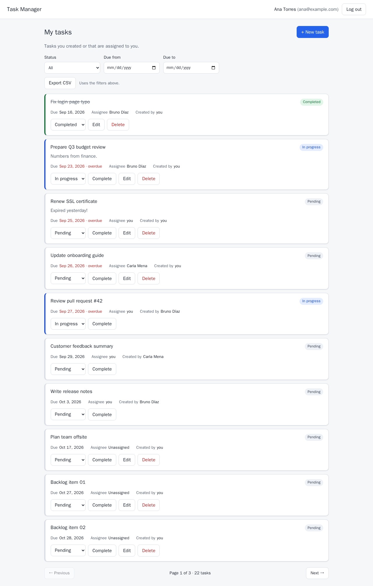
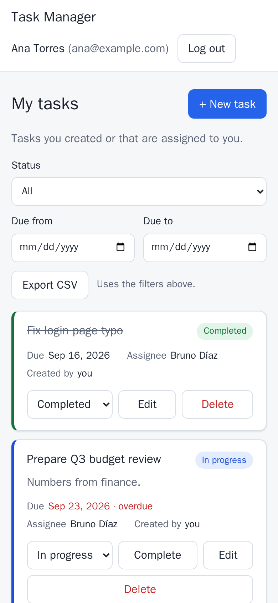
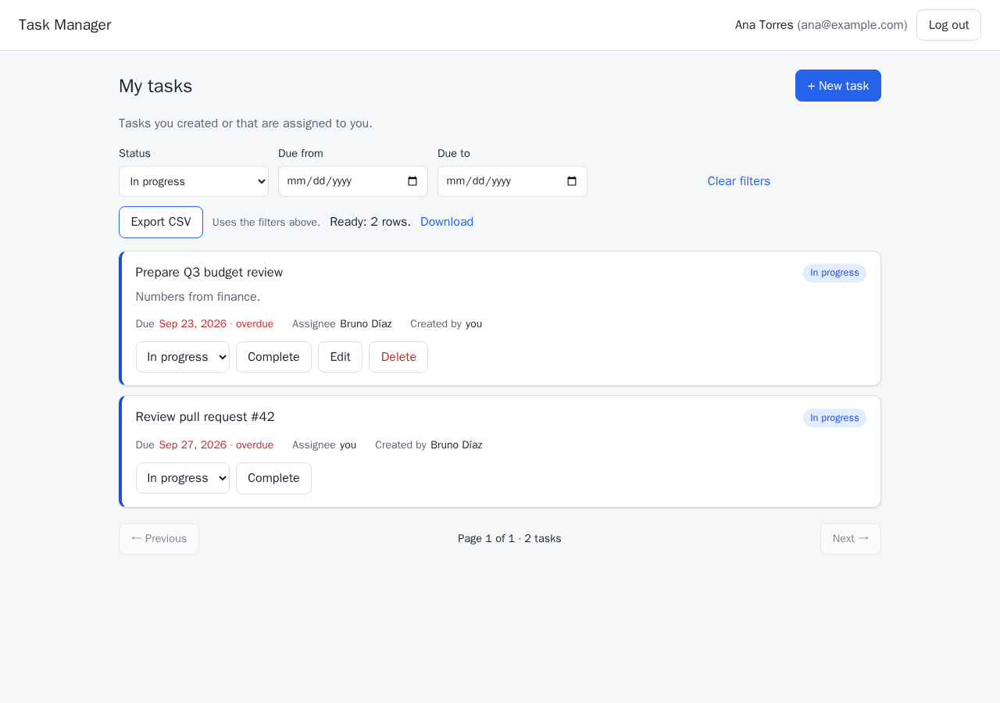
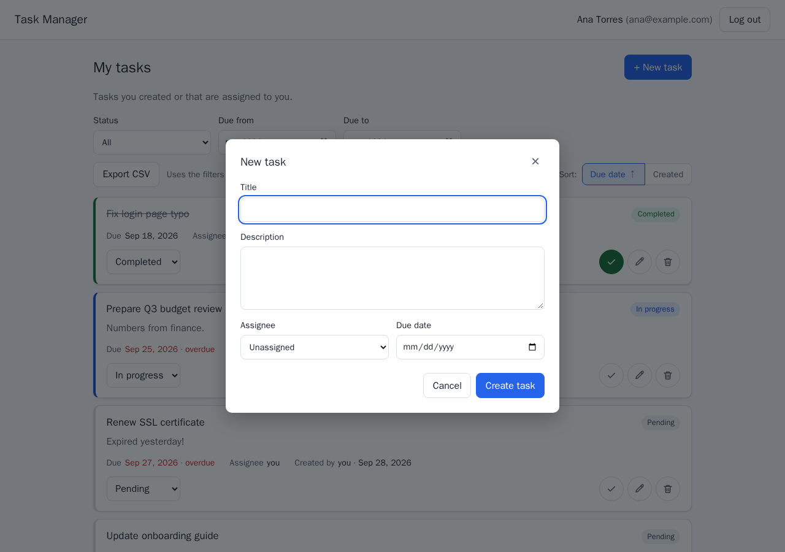
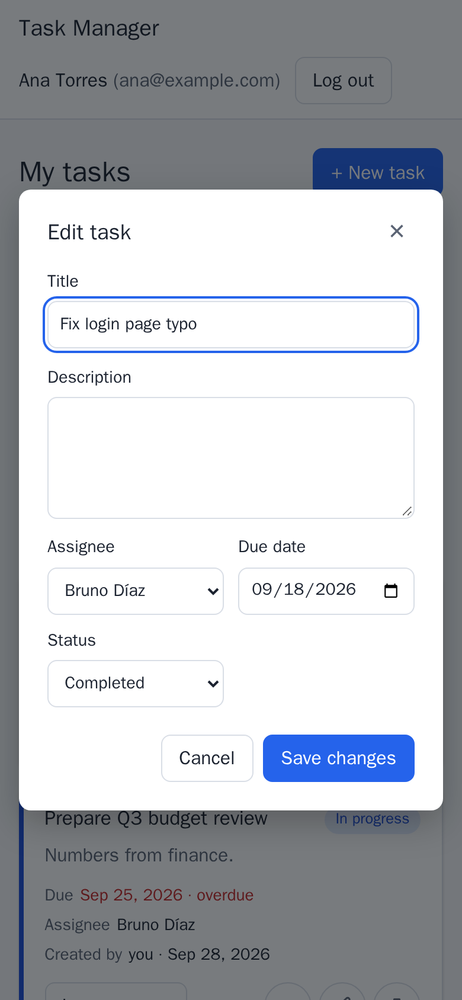

# Task Management

[](https://github.com/pichiloor/task-management-assessment/actions/workflows/ci.yml)

A task manager built for the Ballast Lane Python technical exercise. It has a
FastAPI backend organized in Clean Architecture layers, PostgreSQL, JWT
authentication, rate limiting, a Celery worker for CSV exports and a
responsive React frontend. The whole stack runs with one `docker compose`
command and starts with demo data already loaded.

**User story.** *As a member of a small team, I want to create tasks, assign
them to teammates and see what is due, so that nothing falls through the
cracks. When I need the list outside the app, I want to export it to a file.*

| Tasks (desktop) | Phone |
| --- | --- |
|  |  |

## Contents

- [Quick start](#quick-start)
- [What it does](#what-it-does)
- [Architecture](#architecture)
- [API](#api)
- [Tests and quality](#tests-and-quality)
- [Configuration](#configuration)
- [Key decisions](#key-decisions)
- [Known limitations](#known-limitations)
- [Use of generative AI](#use-of-generative-ai)
- [Repository layout](#repository-layout)

## Quick start

Requirements: Docker Engine with Compose v2, and `sh` with `openssl` or
Python 3 (to generate local secrets). Nothing else needs to be installed.

```sh
git clone https://github.com/pichiloor/task-management-assessment.git
cd task-management-assessment
./scripts/setup-env.sh                 # creates .env with random secrets (once)
docker compose up -d --build --wait    # builds and starts everything
```

Then open **<http://localhost:8080>** and sign in with a demo user:

| Email | Password |
| --- | --- |
| `ana@example.com` | `demo-password-2026` |
| `bruno@example.com` | `demo-password-2026` |
| `carla@example.com` | `demo-password-2026` |

The demo password is public on purpose and only meant for local use. Ana has
enough tasks for three pages; tasks are cross-assigned among the three users,
and due dates are relative to today (overdue, due today, future, none).

| URL | What |
| --- | --- |
| <http://localhost:8080> | React app |
| <http://localhost:8080/api/docs> | Swagger UI (use **Authorize** with a demo email and password) |
| <http://localhost:8080/api/openapi.json> | OpenAPI document |
| <http://localhost:8080/api/health> | Health check (PostgreSQL and Redis) |

Port 8080 is the only one published; set `WEB_PORT` in `.env` to change it.
Stop with `docker compose down` (keeps data) or `docker compose down -v`
(also deletes the database and export volumes).

## What it does

- **Tasks:** create, read, update and delete. A task has a title,
  description, status (`pending`, `in_progress`, `completed`), optional
  assignee and optional due date.
- **Assign and complete:** the creator assigns a task to any active user; the
  creator or the assignee marks it completed (`completed_at` is recorded and
  cleared if the task is reopened).
- **Permissions:** a user sees the tasks they created or are assigned to.
  The creator edits every field and deletes; the assignee may only change the
  status. Tasks that are not visible return 404, not 403, so their existence
  is not revealed.
- **Listing:** filter by status, exact due date or due-date range; sort by
  due date or creation date, in either direction (`sort=due_date`,
  `-due_date`, `created_at`, `-created_at`; tasks without a due date always
  last, ties broken by ID); paginated (`page`, `page_size` up to 100) with
  `total` and `pages`.
- **CSV export in the background:** the API records an export and queues it;
  a Celery worker writes the file; the browser polls the job and downloads the
  CSV. It uses the list's filters and is always ordered by due date (the sort
  chosen on screen is not stored with the export). Only the requester can
  see or download it; files expire after 24 h.
- **Rate limiting:** login 5/minute per client IP, the API 120/minute per
  user, exports 5/minute per user; `429` with `Retry-After`.
- **Frontend:** login, the task list with filters, sort and paging kept in
  the URL (sort with two toggle buttons: *Due date* and *Created*; pressing
  the active one reverses it),
  create/edit dialogs, icon buttons on each task (check to complete or
  reopen, pencil to edit, trash to delete with confirmation), green
  notifications confirming a task was created, changed or deleted, the
  export panel. Works on
  phones and desktops, in light and dark mode, and by keyboard.

| Filter and export | New task | Edit on a phone |
| --- | --- | --- |
|  |  |  |

## Architecture

```text
Browser ──► nginx (web, :8080) ─┬─ /       React build (static files)
                                └─ /api/*  FastAPI (api) ──┬─ PostgreSQL (db)
                                                           └─ Redis (redis) ◄── Celery worker / beat
```

The backend follows Clean Architecture. Dependencies point inward, and
[import-linter](backend/pyproject.toml) enforces it in pre-commit and CI:

| Layer | Package | Contains | May not import |
| --- | --- | --- | --- |
| Domain | `app/domain` | Entities (`Task`, `User`, `Export`), invariants, permission rules, domain errors | application, api, FastAPI, SQLAlchemy, Celery, infrastructure |
| Application | `app/application` | Use cases (`TaskService`, `AuthService`, `ExportService`) and ports (repository, token, hasher and queue interfaces) | api, FastAPI, SQLAlchemy, Celery, infrastructure |
| Infrastructure | `app/infrastructure` | SQLAlchemy models and repositories, Alembic, JWT, Argon2, Redis rate limiter, Celery worker, CSV files, seed | — |
| API | `app/api` | FastAPI routes, request/response schemas, error mapping, dependencies | — |

`create_app()` is the composition root: it reads and validates settings at
startup (a missing or short `JWT_SECRET` stops the process), builds the
concrete adapters and hands them to the use cases. Each task request runs in
one database transaction that is committed before the response is sent.
Export requests are the exception: the export row is committed in its own
transaction before the job is queued (see the architecture document).

The frontend is organized by feature (`auth`, `tasks`, `exports`) on top of a
small typed API client. Its TypeScript types are generated from the backend's
OpenAPI document, and CI fails if they are out of date.

More detail, including the export flow and the data model:
[docs/architecture.md](docs/architecture.md).

### Services

| Service | Image | Role |
| --- | --- | --- |
| `web` | nginx 1.30.1 | Serves the React build, proxies `/api` (only published port) |
| `api` | Python 3.12 | FastAPI under uvicorn, non-root user |
| `worker` | same as `api` | Celery worker: CSV exports and maintenance |
| `beat` | same as `api` | Celery beat: schedules export maintenance every minute |
| `migrate` | same as `api` | One-shot: Alembic migrations, then the idempotent demo seed |
| `db` | PostgreSQL 16.15 | Data |
| `redis` | Redis 7.4.11 | Rate-limit counters (db 0) and Celery broker (db 1), AOF persistence |

## API

All endpoints are under `/api`; business endpoints are under `/api/v1` and
need `Authorization: Bearer <token>`. Business errors (401, 403, 404, 409,
410, 429, 503 and business-rule 422s) share one shape:
`{"detail": "...", "code": "task_not_found"}`; request validation errors
keep FastAPI's standard 422 shape (`detail` is a list). Swagger documents
both.

| Method and path | Description |
| --- | --- |
| `POST /api/v1/auth/token` | Log in (OAuth2 password form: `username` = email), returns a JWT |
| `GET /api/v1/users/me` | Current user |
| `GET /api/v1/users` | Users a task can be assigned to (`id`, `name` only) |
| `GET /api/v1/tasks` | List: `status`, `due_date` or `due_from`/`due_to`, `sort`, `page`, `page_size` |
| `POST /api/v1/tasks` | Create (201 + `Location`) |
| `GET /api/v1/tasks/{id}` | Read |
| `PATCH /api/v1/tasks/{id}` | Change only the fields sent; `assignee_id` and `due_date` accept `null` to clear |
| `DELETE /api/v1/tasks/{id}` | Delete (creator only, 204) |
| `POST /api/v1/exports` | Request a CSV export with the list filters (202) |
| `GET /api/v1/exports/{id}` | Export status (`pending`, `completed`, `failed`) |
| `GET /api/v1/exports/{id}/download` | The CSV (409 while pending, 410 when expired) |
| `GET /api/health` | 200 `ok`, 200 `degraded` (Redis down) or 503 (PostgreSQL down) |

Example with curl:

```sh
TOKEN=$(curl -s -X POST http://localhost:8080/api/v1/auth/token \
  -d 'username=ana@example.com&password=demo-password-2026' | python3 -c 'import sys,json;print(json.load(sys.stdin)["access_token"])')
curl -s "http://localhost:8080/api/v1/tasks?status=pending&page_size=5" -H "Authorization: Bearer $TOKEN"
```

## Tests and quality

| Suite | Count | Where it runs |
| --- | --- | --- |
| Backend unit tests (domain, use cases with in-memory fakes, security, rate limiter) | 15 files | host or Docker |
| Backend integration tests (real PostgreSQL and Redis, HTTP through FastAPI, a real Celery worker) | 11 files | Docker or CI |
| Frontend tests (Vitest + React Testing Library) | 27 tests | host or CI |

Latest results: **393 backend tests passed, 98.51% line and branch coverage**
(the minimum is 80%), and **27 frontend tests passed**. CI runs all of it
on every push to `main` and every pull request; see the badge above.

```sh
# Backend: full suite with coverage, in Docker against a separate *_test database
docker compose run --rm --build backend-tests pytest --cov=app

# Backend: unit tests only, on the host (needs uv)
(cd backend && uv run pytest tests/unit)

# Frontend (needs Node 24)
npm --prefix frontend ci
npm --prefix frontend test
npm --prefix frontend run typecheck
```

TDD was used for the domain rules, use cases, authentication, task
endpoints, seed and rate limiting: the test commit was made while the suite
failed, then the implementation. For the repositories (step 4) and the
export worker (step 9) the tests were written first but committed with the
code, so they are not presented as TDD. Every fix found in review has a
test that was run and seen failing before the fix; for most backend fixes
that test was committed separately first, while the frontend fixes of step
11 put the test and the fix in one commit. The [AI log](docs/ai-log.md)
lists the red/green commit pairs.

Quality tools, all run by pre-commit and again in CI:
Ruff (lint and format), mypy in strict mode, import-linter (architecture
contracts), ESLint, `tsc` (TypeScript strict), detect-secrets and basic file checks.
Dependencies are locked (`uv.lock`, `package-lock.json`), Docker images and
GitHub Actions are pinned.

## Configuration

`./scripts/setup-env.sh` creates `.env` from [.env.example](.env.example)
with a random `JWT_SECRET` and `POSTGRES_PASSWORD`, readable only by you. It
never overwrites an existing `.env`. Compose refuses to start without these
values, and the API refuses a JWT secret shorter than 32 characters.

| Variable | Default | Purpose |
| --- | --- | --- |
| `JWT_ACCESS_TOKEN_EXPIRE_MINUTES` | 60 | Token lifetime |
| `RATE_LIMIT_LOGIN` / `RATE_LIMIT_API` / `RATE_LIMIT_EXPORTS` | `5/minute` / `120/minute` / `5/minute` | Limits (one expression each) |
| `EXPORT_TTL_HOURS` | 24 | How long a finished CSV can be downloaded |
| `WEB_PORT` | 8080 | Host port for nginx |

## Key decisions

The full list with the alternatives considered is in
[docs/decisions.md](docs/decisions.md). The main ones:

- **Clean Architecture enforced by a tool, not by convention.** import-linter
  contracts fail the commit if the domain or use cases import FastAPI,
  SQLAlchemy, Celery or infrastructure. Use cases are tested with in-memory
  fakes; repositories against real PostgreSQL.
- **Synchronous SQLAlchemy 2.** The workload is short CRUD queries; FastAPI
  runs sync endpoints in a thread pool. Async would add complexity without a
  measured need.
- **Permissions in the domain.** Who may see, change or delete a task, and
  who may read an export, are pure functions in `app/domain/permissions.py`
  that the use cases call. Lists are filtered in SQL instead, by one
  visibility predicate shared by the task listing and the CSV export, so
  the list and the file cannot disagree.
- **The database enforces invariants too.** CHECK constraints on status,
  lowercase email and `completed_at` being set exactly when a task is
  completed, so a bug in one layer cannot store an inconsistent row.
- **PostgreSQL is the source of truth for exports, not the queue.** The row
  is committed first and then published; a beat task republishes jobs lost by
  Redis and fails the ones stuck for 30 minutes. The worker is idempotent.
- **Rate limiting with Redis and a memory fallback.** If Redis fails, each
  process counts in memory for 30 seconds instead of failing open or
  rejecting every request. The client IP is taken from `X-Forwarded-For` only
  when the request comes from nginx.
- **Same-origin frontend.** nginx serves the app and proxies `/api`, so there
  is no CORS configuration. The token is kept in `sessionStorage` (see the
  limitations).
- **Typed contract between backend and frontend.** The frontend's types are
  generated from OpenAPI; an API change without regenerating fails CI.

## Known limitations

- **Token in `sessionStorage`.** It is not sent automatically (no CSRF), but
  JavaScript can read it, so an XSS flaw could steal it. nginx sends a strict
  Content-Security-Policy to reduce that risk. An HttpOnly cookie with CSRF
  protection is the alternative for production. There are no refresh tokens
  and no server-side revocation: a token lasts until it expires (60 min), but
  it stops working at once if its user is deactivated.
- **No registration or user management UI.** Users come from the seed.
- **Export jobs are reconciled by polling, not a transactional outbox.** A
  lost job is republished after 2 to 3 minutes; a queue backlog longer than
  2 minutes can produce a duplicate job, which does nothing because the
  worker is idempotent.
- **Offset pagination.** Measured with `EXPLAIN ANALYZE` on 20,000 tasks:
  about 2 ms for the first page and 6 ms for page 500. Keyset pagination
  would keep deep pages constant; not needed at this size.
- **Memory fallback of the rate limiter is per process.** While Redis is
  down, each process counts separately, so the effective limit is
  multiplied by the number of processes.
- **Local deployment only.** No TLS, no cloud configuration; the demo
  password is public.

## Use of generative AI

The exercise asks for the prompt, a sample of the output and how it was
validated and corrected. It is all in [docs/genai/](docs/genai/README.md):

- [The prompt I would use](docs/genai/prompts.md) for the full implementation, and the prompts actually used.
- [A representative sample](docs/genai/generated-sample.md) of generated code, with a correction.
- [How the output was validated](docs/genai/validation.md), including performance.
- [Review findings and corrections](docs/genai/review-and-corrections.md).
- The dated, step-by-step session log: [docs/ai-log.md](docs/ai-log.md).

In short: Claude Code wrote the code step by step from a plan I approved; a
second model (OpenAI Codex, `gpt-6-astra`, read-only) reviewed every change;
I decided each step, each library and each accepted finding. Tests were
written first and checked to fail without the fix they cover.

## Repository layout

```text
backend/
  app/domain/          entities, invariants, permission rules
  app/application/     use cases and ports (interfaces)
  app/infrastructure/  SQLAlchemy, Alembic, JWT, Argon2, Redis, Celery, seed
  app/api/             FastAPI routes, schemas, errors, rate limits
  migrations/          Alembic revisions (hand-written)
  tests/unit/          fast tests with in-memory fakes
  tests/integration/   PostgreSQL, Redis, HTTP and Celery tests
  scripts/             OpenAPI export for the frontend types
frontend/
  src/api/             fetch client, endpoints, generated OpenAPI types
  src/features/        auth, tasks, exports
  src/components/      Modal, ConfirmDialog, Field, Pagination
  tests/               Vitest + Testing Library
  nginx.conf           static files and the /api proxy
docs/                  architecture, decisions, thought process, presentation, GenAI evidence
scripts/               setup-env.sh, gen-api-types.sh
docker-compose.yml     the whole stack
.github/workflows/     CI
```
